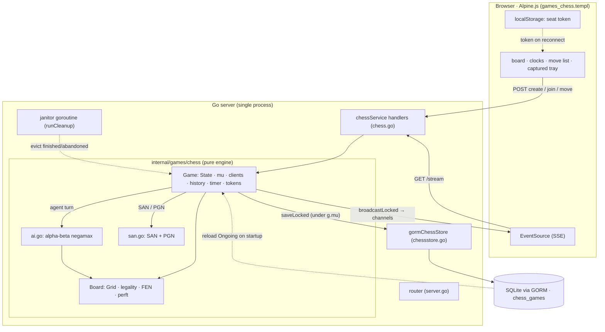
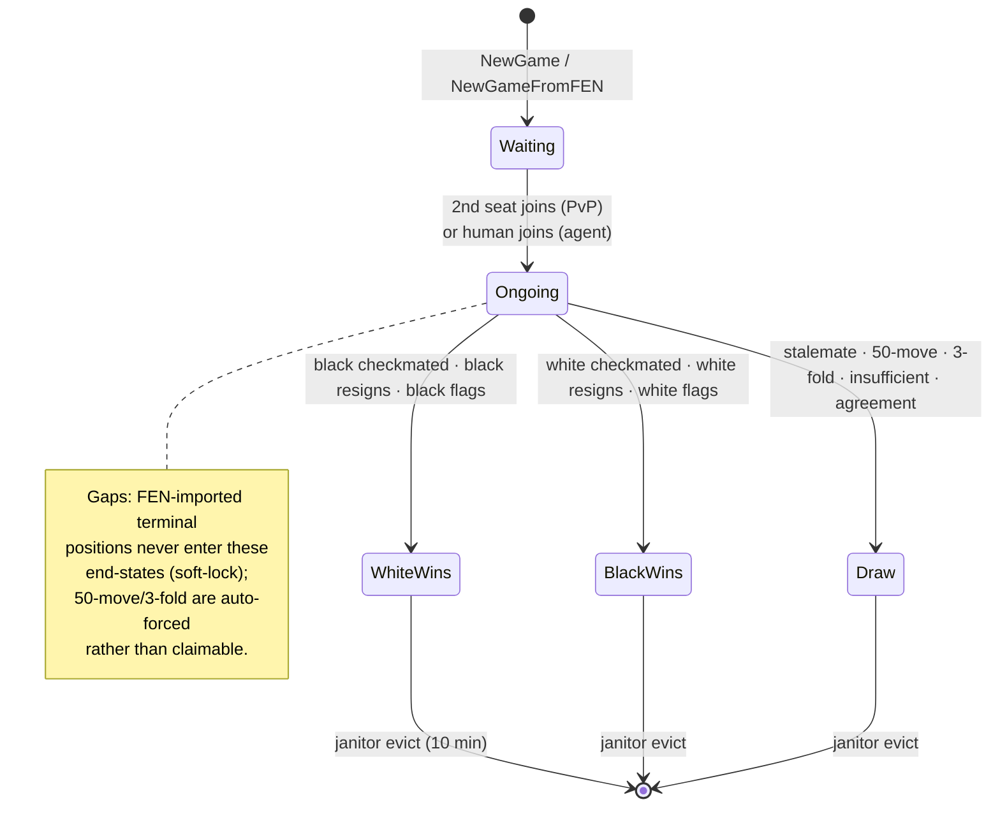
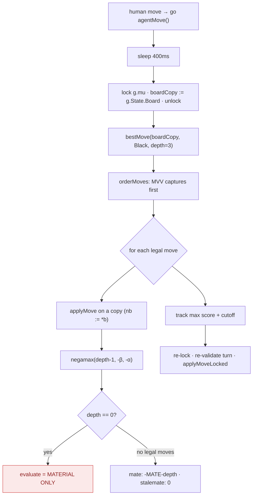
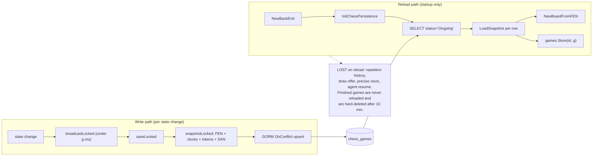
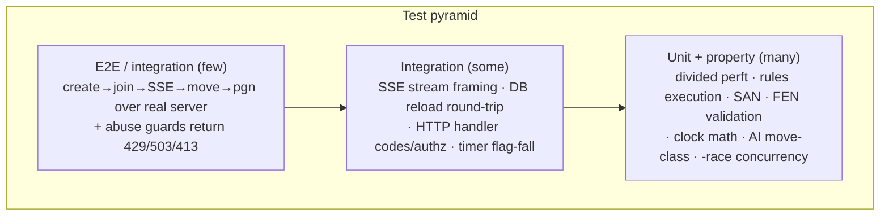
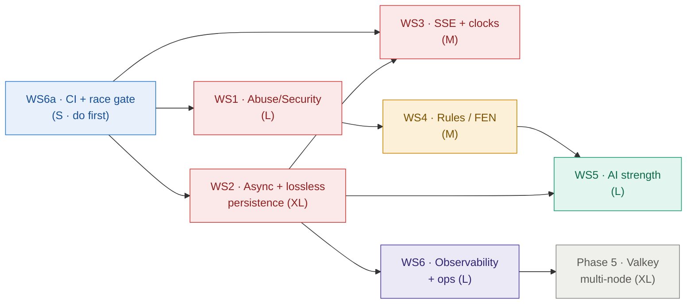

# Chess — Phase 4 Plan & Deep Implementation Analysis

> **How this document was produced.** An 8-dimension automated audit read the
> actual code (engine correctness, concurrency/races, security/abuse,
> persistence/data, AI quality, frontend/real-time, testing, scalability/ops) and
> a synthesis pass deduplicated and ranked the findings. Every gap below cites
> `file:line` evidence. ~90 findings were raised; the 12 highest-blast-radius are
> the spine of this plan.

---

## 0. Executive summary

Phases 0–3 delivered a **rules-correct, feature-complete chess product**: a
from-scratch engine validated by perft (Kiwipete to depth 4 = 4,085,603), timed
multiplayer with seat-token identity and spectators, SQLite persistence, an
alpha-beta AI, matchmaking, and FEN/PGN export. The engine core is genuinely
solid — the auditors verified the move generator, castling/en-passant/promotion,
check-filtering, and several concurrency patterns as **correct**.

The gaps are **not in the chess** — they are in the **operational envelope** around
it. In one sentence each, the four themes:

1. **Abuse surface** — every chess route is unauthenticated and unbounded; an
   anonymous loop can exhaust memory/CPU/sockets.
2. **Hot-path coupling** — a synchronous DB write runs **while the game mutex is
   held**, on every broadcast, pinning each game behind DB latency.
3. **Real-time fragility** — SSE has no reconnect, no heartbeat, and can drop the
   *terminal* event, so a blip freezes a live game forever.
4. **Durability holes** — restarts refund clock time, hang reloaded AI games,
   lose repetition history, and delete all finished-game history.

None of these break a happy-path game today; all of them break *at scale, under
load, or across a deploy*. Phase 4 closes them, gated by a CI test suite that
currently **does not run**.

### Top 12 risks (deduplicated, ranked by severity × blast radius)

| # | Risk | Sev | Effort | Evidence |
|---|------|-----|--------|----------|
| 1 | Unauthenticated, unbounded endpoints → memory/CPU/socket DoS | High | M | `server.go:148-158` (outside `AuthMiddleware`) |
| 2 | Synchronous DB upsert held **inside `g.mu`** on every broadcast | High | M | `game.go:767-769` → `chessstore.go:33-51` |
| 3 | SSE has no reconnect, no heartbeat, drops the terminal event | High | M | `games_chess.templ:386-390`, `game.go:778-784` |
| 4 | Clock integrity: wire clocks are turn-start snapshots; reload refunds time | High | M | `game.go:771-776`, `game.go:253-255` |
| 5 | CI never runs tests/vet/lint/`-race` | High | S | `.github/workflows/build.yaml` |
| 6 | Reloaded agent games (AI to move) never resume; hang to flag-fall | High | S | only `go g.agentMove()` is `game.go:352` |
| 7 | Finished games are `Save()`d then `Delete()`d — no history retained | High | L | `game.go:721-736`, `chessstore.go:68-69` |
| 8 | Single-node: in-memory `sync.Map` + in-process SSE; Valkey unused | High | XL | `game.go:141,767-785` |
| 9 | AI evaluation is material-only → objectively bad quiet moves | **Critical** | L | `ai.go:35-52` |
| 10 | FEN import accepts illegal positions / castling without a rook | Medium | M | `chessboard.go:508-575`, `king.go:47-78` |
| 11 | Seat tokens stored plaintext in DB **and** localStorage | Medium | M | `chessstore.go:19-22`, `games_chess.templ:300,326` |
| 12 | Promotion SAN loses `=Q` when the client omits the choice | Medium | S | `game.go:324-327` vs `chessboard.go:392-400` |

> Note the shape: **#5, #6, #12 are High/Critical severity at S effort** — the
> quick wins. **#8 (multi-node) is XL** and is explicitly deferred to Phase 5.

---

## 1. What has been built (Phases 0–3)

### 1.1 Component architecture



### 1.2 Move handling — the request path

```mermaid
sequenceDiagram
  autonumber
  participant W as White (human)
  participant H as Handler (chess.go)
  participant G as Game (holds g.mu)
  participant DB as Store (GORM)
  participant AG as Agent goroutine
  participant C as SSE clients

  W->>H: POST /move {token, from, to, promo}
  H->>G: SeatColor(token) → color (client color not trusted)
  H->>G: MakeMove(color, from, to, promo)
  activate G
  G->>G: check status / turn / ownership / legality
  G->>G: applyMoveLocked: SAN, charge clock, switch turn, updateStatus
  G->>DB: saveLocked — SYNCHRONOUS, holding g.mu (risk #2)
  G->>C: broadcastLocked — drops on full buffer (risk #3)
  deactivate G
  G-->>H: nil
  H-->>W: 200
  opt Agent game AND Black to move
    G->>AG: go agentMove()
    AG->>AG: sleep 400ms; snapshot board under lock; unlock
    AG->>AG: bestMove (alpha-beta, off-lock)
    AG->>G: re-lock, re-validate turn, applyMoveLocked
    G->>C: broadcastLocked
  end
```

### 1.3 Game lifecycle (status state machine)



### 1.4 AI search flow



*The red node is the critical weakness: with a material-only leaf evaluation and
no quiescence search, every quiet move scores identically and the AI blunders at
the depth horizon.*

### 1.5 Persistence — write-through and reload



---

## 2. Gap analysis

Grouped by theme. Severity ∈ {Critical, High, Medium, Low}; Effort ∈ {S, M, L, XL}.
"✓ verified-correct" items are things the audit checked and found **sound** — they
are documented so a future refactor doesn't silently break a load-bearing
invariant.

### 2.1 Security & abuse — *the public surface is undefended*

| Gap | Sev | Ev |
|-----|-----|-----|
| All `/chess/*` routes are outside `AuthMiddleware`; no rate limit, no game cap | High | `server.go:148-158` |
| Unbounded SSE connections per game; one idle stream pins a game forever | High | `game.go:277-297`, `chess.go:100-147` |
| Unbounded concurrent AI searches (one CPU-heavy goroutine per human move) | Medium | `game.go:352`, `ai.go:64-119` |
| `/open` enumerates every waiting game id; anyone can hijack the black seat | Medium | `chess.go:223-230`, `game.go:262-275` |
| No `http.MaxBytesReader` → multi-GB `fen` body OOM | Medium | `chess.go:30,79,161` |
| No `ReadHeaderTimeout`/`IdleTimeout` → Slowloris | Medium | `server.go:43-48` |
| Seat tokens stored plaintext (DB) and in localStorage (XSS-readable) | Medium | `chessstore.go:19-22`, `templ:300,326` |
| SSE `Access-Control-Allow-Origin: *` → any site reads any game | Low | `chess.go:119` |
| `crypto/rand` errors ignored → a failed read yields a constant token | Low | `generateGameID.go:26` |

**✓ verified-correct:** seat tokens are 192-bit (`24 bytes` from `crypto/rand`);
the client-asserted color is never trusted (`SeatColor` resolves from the token);
out-of-turn and opponent-piece moves are rejected server-side; spectators never
receive a token; the SSE payload omits tokens; `getPieceSVG` `x-html` is a fixed
switch with no injection path.

### 2.2 Concurrency & persistence hot-path — *correct, but coupled to I/O*

| Gap | Sev | Ev |
|-----|-----|-----|
| `store.Save` is a **synchronous DB round-trip held under `g.mu`** on every broadcast | High | `game.go:767-769`, `chessstore.go:33-51` |
| `broadcastLocked` drops SSE events on a full buffer — can lose the *terminal* event | Medium | `game.go:778-784` |
| SSE snapshot aliases the live `ValidMoves` map / `Moves` slice / pointers, marshaled off-lock | Medium | `game.go:771`, `chess.go:137` |
| `runCleanup` deletes after releasing `g.mu` (TOCTOU); a late save can resurrect a deleted row | Medium | `game.go:721-739`, `chessstore.go:47-50` |
| DB `Save`/`Delete` errors are silently discarded | Medium | `chessstore.go:47-55` |
| `newGame` uses `Load`-then-`Store` (not `LoadOrStore`) for id uniqueness | Low | `game.go:185-210` |
| Package-global `store` set without synchronization | Low | `game.go:164-167` |

**✓ verified-correct (race-free today, but fragile):** the off-lock AI search
(safe because `Grid` is a value array and pieces are immutable); timer
re-entrancy in `flagTimeout` (the `turn`/remaining rechecks are load-bearing);
SSE channel lifecycle (buffered initial send under lock, `RemoveClient` closes
after removing from `clients`). A `go test -race` run today would **pass** — but
these invariants are undocumented landmines.

### 2.3 Real-time delivery & clocks — *a blip freezes the game*

| Gap | Sev | Ev |
|-----|-----|-----|
| `eventSource.onerror` closes the stream permanently — no reconnect/backoff | High | `templ:386-390` |
| Server sends no `: ping` heartbeat — proxies drop idle SSE | High | `chess.go:100-147` |
| Wire clocks are the turn-*start* snapshot, not live remaining → late clients see phantom time | High | `game.go:771-776` |
| Move/action POSTs ignore `res.ok` — rejected moves fail silently | Medium | `templ` makeMove/sendAction |
| Draw offer vs the AI hangs forever (AI never responds to offers) | Medium | `game.go` OfferDraw + agent |
| Captured-piece tray miscounts after any promotion | Medium | `templ` capturedBy() |
| No ARIA / `aria-live` — board is opaque to screen readers | Medium | `templ` board grid |
| Reconnect to an expired game 404s into a dead-end; stale localStorage left behind | Medium | `templ` connectSSE onerror |
| `setInterval` clock ticker never cleared; runs when idle/finished | Low | `templ` init() |

### 2.4 Engine rules fidelity & FEN robustness — *edges, not mainline*

| Gap | Sev | Ev |
|-----|-----|-----|
| Promotion SAN loses `=Q` when client omits choice (board=queen, PGN=`a8`) | Medium | `game.go:324-327` vs `chessboard.go:392-400` |
| Threefold history discarded on reload (draw becomes unenforceable) | Medium | `game.go:251` |
| FEN-imported terminal positions never detected → soft-lock | Medium | `NewGameFromFEN` never calls `updateStatusLocked` |
| `EnPassant` set on **every** double push, even when no pawn can capture | Medium | `chessboard.go:137-140` |
| FEN castling rights trusted without a matching rook → illegal "castle" | Medium | `chessboard.go:547-558`, `king.go:47-78` |
| 50-move / 3-fold are **auto-forced** draws, not claimable (FIDE deviation) | Medium | `game.go:530-537` |
| `InsufficientMaterial` covers only a conservative subset | Low | `chessboard.go:465-503` |
| FEN import has no structural validation (king count, rank width, ep rank) | Low | `chessboard.go:508-575` |

**✓ verified-correct:** the perft suite matches reference node counts through
Kiwipete depth 4, en-passant discovered-check is handled, `K+B vs K+B` same-color
is drawn, and `IsAttacked` models pawn attacks independently of `ValidMoves`.

### 2.5 AI quality — *correct search, crippled evaluation*

| Gap | Sev | Ev |
|-----|-----|-----|
| Evaluation is **material-only** — no PST, mobility, pawn structure, king safety | **Critical** | `ai.go:35-52` |
| No quiescence search — guaranteed horizon effect on capture sequences | High | `ai.go:89-119` |
| No king-safety/castling term — AI exposes its king, never castles | High | `ai.go:35-52` |
| Flat eval can't convert won endgames (no mate gradient) → risks 50-move draw | High | `ai.go` |
| Fixed depth 3, no iterative deepening / time budget | Medium | `ai.go:64-87` |
| AI hardwired to Black; agent-as-White / FEN agent games with Black-to-move never move | Medium | `game.go:352` |
| No difficulty levels, no opening book, deterministic tie-break (exploitable) | Medium | `ai.go` |
| No transposition table; per-node double board copy + O(64) king scan | Medium | `ai.go`, `chessboard.go` |
| Weak ordering (MVV without LVA, no killer/history); search is draw-blind | Low | `ai.go:121-136` |

### 2.6 Testing — *the seams are untested and nothing gates merges*

| Gap | Sev | Ev |
|-----|-----|-----|
| CI never runs the suite; the image ships to `:latest` unverified | High | `build.yaml` |
| No `-race` anywhere despite goroutines/timers/shared map | High | — |
| SSE `StreamGame` handler: zero coverage | High | — |
| HTTP handlers (create/join/move/pgn/open) untested end-to-end | High | — |
| No chess integration test in `test/` | High | — |
| DB reload path (`InitChessPersistence` → `LoadSnapshot` from a real row) untested | High | — |
| Async `agentMove` goroutine path untested (only the sync inner fn) | Medium | — |
| Real `time.AfterFunc` auto-forfeit never fires in a test | Medium | — |
| No concurrent-access (`-race`) test | Medium | — |
| Divided perft (captures/ep/castles/promos/checks/mates) not validated; depth capped at 4 | Low | `chess_test.go` |
| No AI benchmark | Low | — |

### 2.7 Scalability & ops — *single-node and unobservable*

| Gap | Sev | Ev |
|-----|-----|-----|
| Single-node: in-memory `sync.Map` + in-process SSE; Valkey injected but unused | High | `game.go:141,767-785` |
| No metrics / structured logging in the game layer | Medium | — |
| No graceful drain / final flush on shutdown (`Shutdown(ctx)` with a cancelled ctx) | Medium | `cmd/server.go:57-59` |
| Static health check always 200 — can't detect an unhealthy replica | Medium | `server.go:58-67` |
| All tunables hardcoded (clock, `aiDepth`, TTLs, port) | Low | `game.go`, `ai.go` |
| `ListOpenGames`/janitor do O(N) locking scans on an unauth endpoint | Low | `game.go:262-275` |

---

## 3. Design-decision review

The gaps above trace back to a handful of deliberate early choices. Each was
**right for shipping Phases 0–3** and now needs revisiting.

| Decision | Why it was right | Where it now bites | Phase 4 direction |
|---|---|---|---|
| **In-memory `sync.Map` + in-process SSE** | Zero infra; fastest path to a working real-time game | Hard single-node ceiling; a restart drops all streams; two players on different replicas can't see each other | Keep for Phase 4 (add heartbeat/reconnect); externalize to Valkey pub/sub in **Phase 5** |
| **FEN-snapshot write-through on every broadcast** | Simple, stateless-ish persistence; survives restart | Sync DB call under `g.mu`; O(n²) `MovesJSON` rewrites; loses history/clock/draw-offer/agent-resume | Async per-game coalescing writer; persist the missing fields; archive finished games |
| **Material-only depth-3 AI** | Small, correct, good enough to demo | Objectively weak play; horizon blunders; can't convert wins | PST + quiescence + iterative deepening + difficulty levels |
| **Seat = random bearer token** | Enables anonymous share-a-link play without accounts | No account attribution; plaintext at rest and in localStorage; no "my games" | Hash at rest; add optional `user_id` FKs; keep token as a reconnection secret |
| **Unauthenticated public routes** | Frictionless play | Trivial DoS surface | Rate-limit + caps + body limits + timeouts; optional auth for ranked play |
| **Auto-forced 50-move/3-fold draws** | Simplest correct-ish termination | Diverges from FIDE (claimable), can hand away wins | `ClaimDraw` endpoint; keep only 75-move/5-fold automatic |

---

## 4. The Phase 4 plan — six workstreams

Each workstream lists concrete items and a representative code example. Efforts:
WS1 L · WS2 XL · WS3 M · WS4 M · WS5 L · WS6 L (multi-node deferred to Phase 5).

### WS6a (do first) — CI test/race gate

The suite already exists; nothing runs it. This one job de-risks every other
change and is a day of work.

```yaml
# .github/workflows/ci.yaml  (runs on PRs + master; gates the image build)
name: CI
on: { push: { branches: [master] }, pull_request: {} }
jobs:
  test:
    runs-on: ubuntu-latest
    steps:
      - uses: actions/checkout@v4
      - uses: actions/setup-go@v5
        with: { go-version: '1.25' }
      - run: go vet ./...
      - run: go test -race -count=1 ./test/... ./internal/games/... ./internal/server/games/...
      - uses: golangci/golangci-lint-action@v6
  # the existing build-and-deploy job gains:  needs: test
```

### WS1 — Edge abuse & security hardening (L)

Rate limiting, live-game cap, body caps, server timeouts, an AI worker pool, SSE
caps, private games, token hardening.

```go
// A shared limiter + body cap middleware for the chess POST routes.
func GameGuards(next http.Handler) http.Handler {
    limiter := newIPRateLimiter(rate.Limit(5), 10) // 5 rps, burst 10 per IP
    return http.HandlerFunc(func(w http.ResponseWriter, r *http.Request) {
        r.Body = http.MaxBytesReader(w, r.Body, 8<<10) // 8 KB is ample
        if !limiter.Allow(clientIP(r)) {
            http.Error(w, "rate limited", http.StatusTooManyRequests)
            return
        }
        if liveGameCount() > maxLiveGames {
            http.Error(w, "server busy", http.StatusServiceUnavailable)
            return
        }
        next.ServeHTTP(w, r)
    })
}

// Bound concurrent AI searches to the machine, not the request rate.
var aiSem = make(chan struct{}, runtime.NumCPU())
func (g *Game) playAgentReply() {
    aiSem <- struct{}{}; defer func() { <-aiSem }()
    // ... existing snapshot → bestMove → re-validate → apply ...
}
```

```go
// server.go — close Slowloris; leave WriteTimeout unset for long-lived SSE.
return &http.Server{
    Addr:              fmt.Sprintf(":%d", port),
    Handler:           s.Routes(),
    ReadHeaderTimeout: 5 * time.Second,
    IdleTimeout:       60 * time.Second,
}
```

### WS2 — Persistence: non-blocking, lossless, durable (XL)

Take the write off the mutex; persist what is lost; archive finished games.

```go
// Per-game single-writer that coalesces to the latest snapshot — off the hot path.
type Game struct {
    // ...
    saveCh chan Snapshot // buffered, size 1
}
func (g *Game) saveLocked() {          // still called under g.mu, but now non-blocking
    if store == nil { return }
    snap := g.snapshotLocked()
    select {
    case g.saveCh <- snap:             // enqueue latest
    default:                           // coalesce: drop the queued one, keep newest
        select { case <-g.saveCh: default: }
        select { case g.saveCh <- snap: default: }
    }
}
func (g *Game) persistLoop() {         // one goroutine per game, no lock held
    for snap := range g.saveCh {
        if err := store.Save(snap); err != nil {
            logger.Error("chess save failed", zap.String("id", snap.ID), zap.Error(err))
        }
    }
}
```

```go
// Snapshot gains the fields that are currently lost, and reload charges elapsed time.
type Snapshot struct {
    // ... existing FEN, clocks, tokens, Moves ...
    InitialFEN      string
    History         map[string]int // threefold counts
    DrawOfferedBy   *string
    TurnStartedAt   int64          // unix millis; charge elapsed on reload
}

func LoadSnapshot(s Snapshot) (*Game, error) {
    // ... build board/game ...
    if s.History != nil { g.history = s.History }
    if s.Status == StatusOngoing && !s.TurnStartedAt.IsZero() {
        elapsed := time.Since(time.UnixMilli(s.TurnStartedAt)).Milliseconds()
        g.chargeElapsedLocked(elapsed)            // no free time across a restart
    }
    if g.State.Status == StatusOngoing &&
        g.State.GameType == TypeAgent && g.State.Turn == Black {
        go g.agentMove()                          // fixes risk #6
    }
    // ...
}
```

Plus: an immutable `chess_game_results` archive written on terminal status (stop
hard-deleting history); a DB-side sweep for orphaned non-`Ongoing` rows; nullable
`white_user_id`/`black_user_id` FKs; hashed tokens at rest.

### WS3 — Real-time delivery & clock accuracy (M)

Heartbeat, client reconnect with backoff, guaranteed terminal delivery, live
clocks, marshal-under-lock.

```go
// StreamGame: heartbeat so proxies keep the stream open; retry hint for the client.
fmt.Fprint(w, "retry: 3000\n\n")
ping := time.NewTicker(20 * time.Second); defer ping.Stop()
for {
    select {
    case <-ctx.Done(): return
    case <-ping.C: fmt.Fprint(w, ": ping\n\n"); flusher.Flush()
    case ev := <-clientChan:
        w.Write([]byte("data: " + string(ev) + "\n\n")); flusher.Flush()
    }
}
```

```javascript
// Client: bounded exponential-backoff reconnect (replaces the permanent close()).
connectSSE() {
    this.es = new EventSource(`/games/chess/stream?id=${this.gameId}`);
    this.es.onopen  = () => { this.connState = 'live'; this.retry = 0; };
    this.es.onmessage = (e) => this.applyUpdate(JSON.parse(e.data));
    this.es.onerror = () => {
        this.connState = 'reconnecting';
        this.es.close();
        const delay = Math.min(1000 * 2 ** this.retry++, 15000);
        setTimeout(() => this.connectSSE(), delay);
    };
}
```

Server-side, broadcast `remainingMsLocked()` for **both** colors (not the
turn-start snapshot) and marshal the event to `[]byte` under the lock so nothing
shared escapes to the SSE goroutine.

### WS4 — Engine rules fidelity & FEN robustness (M)

```go
// Fix the promotion SAN/board disagreement: resolve promo ONCE, use it everywhere.
promo := PawnType
if pt, ok := PieceTypeFromString(promotion); ok { promo = pt }
if piece.Type() == PawnType && (toPos.Row == 0 || toPos.Row == 7) && promo == PawnType {
    promo = QueenType // same default the board uses — now SAN records "=Q"
}
// ... moveSAN(&board, from, to, promo) and MovePiece(from, to, promo) get the SAME promo.
```

```go
// Set EnPassant only when a capture is actually possible (correct repetition + FEN).
if isPawn && abs(to.Row-from.Row) == 2 {
    ep := Position{Row: (from.Row + to.Row) / 2, Col: from.Col}
    for _, dc := range []int{-1, 1} {
        c := to.Col + dc
        if b.InBounds(to.Row, c) {
            if p := b.Grid[to.Row][c]; p != nil && p.Type() == PawnType && p.Color() != color {
                b.EnPassant = &ep
            }
        }
    }
}
```

```go
// Validate FEN and detect terminal-on-import (stops illegal castle + soft-lock).
func validatePosition(b *Board, turn Color) error {
    if countKings(b, White) != 1 || countKings(b, Black) != 1 {
        return errors.New("each side must have exactly one king")
    }
    if b.InCheck(turn.Opponent()) {
        return errors.New("side not to move is in check")
    }
    // drop castling rights lacking a home rook; check ep-square rank; etc.
    return nil
}
```

Plus a `POST /claim-draw` endpoint that draws only when 50-move/3-fold currently
holds, leaving 75-move/5-fold automatic.

### WS5 — AI strength & configurability (L)

Highest single leverage is the evaluation. A phase-tapered piece-square table plus
a quiescence search will lift play from "answers 1.e4 with a6" to a credible club
opponent.

```go
// Piece-square tables replace the flat material term (values in centipawns).
var pawnPST = [64]int{ /* +center, +advance */ }
var knightPST = [64]int{ /* -rim, +center */ } // "a knight on the rim is dim"
// ... evaluate() sums material + PST[sq] (mirrored for Black), tapered by game phase.

// Quiescence search removes the horizon effect: at depth 0, keep searching captures.
func quiesce(b *Board, color Color, alpha, beta int) int {
    stand := evalFor(b, color)
    if stand >= beta { return beta }
    if stand > alpha { alpha = stand }
    for _, m := range b.captureMoves(color) {         // captures + promotions only
        nb := *b; nb.applyMove(m.From, m.To, m.Promotion)
        score := -quiesce(&nb, color.Opponent(), -beta, -alpha)
        if score >= beta { return beta }
        if score > alpha { alpha = score }
    }
    return alpha
}

// Iterative deepening under a time budget replaces fixed depth 3.
func bestMoveTimed(b *Board, color Color, budget time.Duration) LegalMove {
    deadline := time.Now().Add(budget); var best LegalMove
    for depth := 1; ; depth++ {
        m, ok := searchRoot(b, color, depth, deadline)
        if !ok { break } // ran out of time mid-depth; keep previous
        best = m
        if time.Now().After(deadline) { break }
    }
    return best
}
```

Plus: king-safety/castling term and an endgame king-drive term (to convert
KQ/KR-vs-K); draw-awareness (contempt) so the search doesn't shuffle into a
repetition draw; difficulty levels (depth + blunder jitter); a Zobrist
transposition table; make/unmake to kill the double board copy; and making
`agentColor` game state (so the AI can play White and resume from any position).

### WS6 — Observability, ops & (deferred) multi-node (L)

Metrics + structured logging in the game layer; readiness vs liveness health
(ping DB/Valkey); graceful drain (a *fresh* bounded context for `Shutdown`, final
`Save` of `Ongoing` games, an SSE shutdown event); externalize tunables to config;
a dedicated open-games index so `/open` is O(open).

> **Deferred to Phase 5 (XL):** publish `Event`s to Valkey per-game channels and
> subscribe per node; move authoritative state to Valkey/Postgres. This is the
> only path to true horizontal scale and depends on WS2's state externalization.

---

## 5. Test plan — a pyramid mapped to the gaps



| Area | What to test | Approach |
|---|---|---|
| **CI/tooling** | Suite runs and gates merges; `-race` exercises the goroutine surface | GH Actions: `go vet`, `go test -race -count=1 ./...`, lint; image build `needs: test` |
| **Concurrency** | No race under parallel Join/AddClient/RemoveClient/MakeMove/flagTimeout; off-lock AI copy | 50× goroutine fan-out + concurrent `bestMove` vs moves — only meaningful under `-race` |
| **HTTP handlers** | 403 wrong/spectator token · 400 bad JSON/FEN · 404 unknown id · correct create/join bodies | table-driven `httptest.ResponseRecorder` |
| **SSE stream** | headers, `data:` framing, initial state, `RemoveClient` on disconnect, heartbeat, guaranteed terminal delivery to a slow client | `ResponseRecorder` (implements `Flusher`) + a buffer-full coalesce test |
| **Persistence/reload** | round-trip restores turn/moves/tokens; history rebuilt; wall-clock charged; agent resumes; terminal loads terminal | in-memory sqlite; re-init store against same DB (simulated restart) |
| **Timer/clock** | real `AfterFunc` flags the side that runs out; re-arms after a move; wire value = live remaining | tiny `WhiteTimeMs`, arm, sleep past, assert `StatusBlackWins` |
| **Async agent** | `MakeMove` spawns agent which replies without deadlock; never moves after game end | short `agentThinkDelay`, bounded-poll for move count, under `-race` |
| **Rules (execution)** | queenside castling relocates a-rook; ep exposing king rejected; rook-capture revokes rights; `MakeMove(...,"knight")` → `=N`; empty promo → `=Q`; EnPassant unset with no capturer | focused FEN board-state assertions |
| **Perft (property)** | divided perft (captures/ep/castles/promos/checks/mates) vs references; start depth 5 | env-gated (`PERFT_DEEP`) nightly + "every generated move is legal" property |
| **FEN validation** | illegal FENs rejected; imported terminal detected | table-driven `NewGameFromFEN` error/status assertions |
| **AI quality/perf** | picks a developing move over `a6`; converts KQ/KR-vs-K in bounded moves; no horizon blunder | scenario tests + `BenchmarkBestMove` (start & Kiwipete) + "never illegal" property |
| **E2E & limits** | full create→join→SSE→move→pgn; limiter/cap return 429/503; oversized body 413 | extend `test/setupTestServer` to drive chess routes |

Example — the missing async-agent + timer tests (illustrative):

```go
func TestAsyncAgentReplies(t *testing.T) {
    oldDelay := agentThinkDelay; agentThinkDelay = time.Millisecond
    defer func() { agentThinkDelay = oldDelay }()
    g, _ := NewGame(TypeAgent); g.Join()
    _ = g.MakeMove("white", "e2", "e4", "") // spawns go agentMove()
    require.Eventually(t, func() bool {
        g.mu.Lock(); defer g.mu.Unlock()
        return len(g.State.Moves) == 2 && g.State.Turn == White
    }, time.Second, 5*time.Millisecond)
}

func TestFlagFallForfeits(t *testing.T) {
    g, _ := NewGame(TypePvP); g.Join(); g.Join()
    g.mu.Lock(); g.State.WhiteTimeMs = 20; g.turnStartedAt = time.Now(); g.armClockLocked(); g.mu.Unlock()
    require.Eventually(t, func() bool {
        g.mu.Lock(); defer g.mu.Unlock(); return g.State.Status == StatusBlackWins
    }, time.Second, 5*time.Millisecond)
}
```

---

## 6. Sequencing



**The rationale, in order:**

1. **CI + race gate first** (S). The suite exists but gates nothing. In code this
   concurrency-heavy, every later fix risks a silent regression. One day of work
   that de-risks everything after it.
2. **Then the three high-blast stability streams in parallel** (WS1, WS2-async,
   WS3) — they touch live production for all users now and need no new subsystem:
   move `store.Save` off the mutex, make SSE survive blips and deliver the terminal
   event, and put guardrails on the public routes.
3. **Then the small correctness/reload fixes** (WS4 + the WS2 reload items), several
   of which *also* close abuse/exploit vectors: resume the agent on reload, charge
   wall-clock on reload, fix the promotion SAN, validate FEN.
4. **Then durability + observability** (WS2 archive/identity + WS6) — unblocks
   product features (ratings, reconnect-by-account, history) rather than fixing an
   active outage.
5. **Last, AI strength** (WS5, the lone *Critical* finding but bounded to agent-game
   quality) **and the deferred multi-node capstone** (Phase 5).

**Definition of done for Phase 4:** CI runs `-race` on every PR and gates the
image; an anonymous client cannot exhaust the server; a network blip or deploy no
longer freezes or corrupts a live game; a restart preserves clocks, draws, and
agent turns; finished games are archived; and the AI plays real chess. Multi-node
(Valkey fan-out) is explicitly Phase 5.
